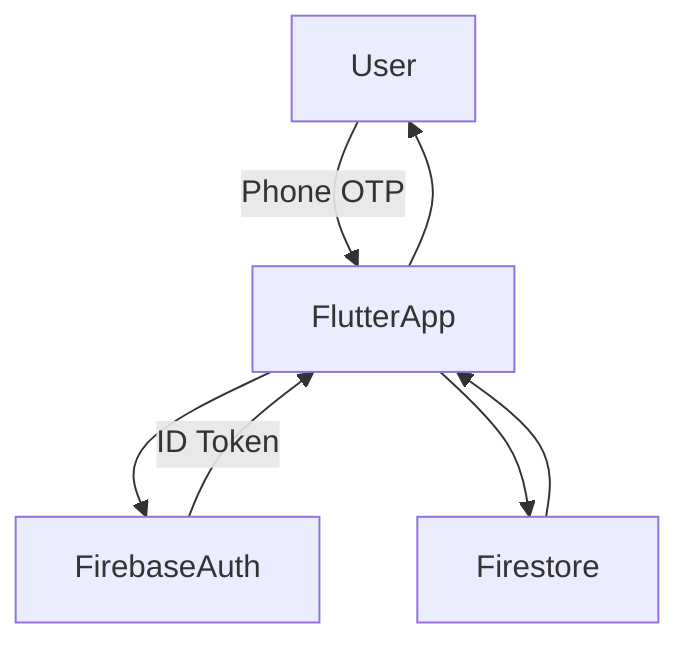

# GrowTown – System Architecture & Documentation

Version: 1.0.0
Last Updated: 2026-01-23

---

## A. System Overview

### A.a Tech Stack

GrowTown is a **Flutter + Firebase** based mobile application designed for loyalty management and customer engagement.

**Frontend**

* Flutter
* Dart

**Backend / Services (BaaS)**

* Firebase Authentication (Phone Number Authentication)
* Cloud Firestore (NoSQL Database)
* Firebase Storage (optional – profile images, assets)
* Firebase Cloud Functions (optional – business logic & validation)

**Tools & Documentation**

* Postman (API documentation & examples)
* GitHub (Version control & collaboration)

---

### A.b High-Level Architecture

GrowTown follows a **client-driven architecture** where the Flutter app directly communicates with Firebase services using official Firebase SDKs.

* The Flutter app handles UI and user interaction
* Firebase Auth manages secure user authentication using phone numbers
* Firestore stores and retrieves application data (customers, points, transactions)
* Cloud Functions (if used) act as a controlled backend layer for complex logic

There is **no traditional REST backend**, but Firebase interactions are documented using Postman for clarity and onboarding.

---

## B. Directory Structure

```text
lib/
 ┣ main.dart              # App entry point
 ┣ screens/               # UI screens (Login, Dashboard, Customer List)
 ┣ widgets/               # Reusable UI components
 ┣ services/              # Firebase services (Auth, Firestore operations)
 ┣ models/                # Data models (Customer, Transaction)
 ┗ utils/                 # Helpers, constants, validators
```

This structure ensures separation of concerns, readability, and scalability.

---

## C. Data Flow / System Diagram

### C.a Data Flow Explanation

1. User opens the GrowTown app
2. User authenticates using **phone number (OTP)** via Firebase Auth
3. Firebase returns a **secure ID token**
4. Flutter app uses this token to:

   * Create or fetch customer data from Firestore
   * Update loyalty points
   * Fetch dashboard summaries
5. Firestore responds with real-time data updates
6. UI updates automatically using Flutter’s reactive model

### C.b Mermaid Diagram (Logical Flow)



---

## D. Firebase Setup & Integration

### D.a Firebase Products Used

* **Firebase Authentication**

  * Phone Number based login (OTP)
  * Secure session handling via ID tokens

* **Cloud Firestore**

  * customers collection
  * loyalty points tracking
  * transaction history

* **Firebase Storage (Optional)**

  * Store images or documents related to customers

* **Cloud Functions (Optional)**

  * Validate point calculations
  * Prevent unauthorized writes

---

### D.b Authentication & Data Access

* Users authenticate using phone number OTP
* Firebase issues an **ID Token** after successful login
* This token is attached as a **Bearer Token** in API documentation examples
* Firestore rules ensure:

  * Only authenticated users can read/write
  * Users can access only permitted collections

---

### D.c Security Rules & Validation

* Firestore security rules restrict unauthorized access
* Server-side validation (Cloud Functions) can be used for:

  * Preventing point manipulation
  * Ensuring correct data formats

---

## E. Deployment & Maintenance

### E.a Build & Deployment

* Flutter app is built using:

  ```bash
  flutter build apk
  flutter build ios
  ```
* Firebase handles backend deployment automatically
* App can be deployed via:

  * Google Play Store
  * Apple App Store

---

### E.b Environment & Setup for New Contributors

Steps to set up locally:

1. Clone the repository
2. Run `flutter pub get`
3. Add Firebase configuration files:

   * `google-services.json` (Android)
   * `GoogleService-Info.plist` (iOS)
4. Enable Firebase Auth & Firestore in Firebase Console
5. Run the app

---

### E.c Documentation Update Checklist

For every new feature:

* [ ] Update Firestore schema (if changed)
* [ ] Add or update Postman API examples
* [ ] Update ARCHITECTURE.md if flow changes
* [ ] Bump API documentation version
* [ ] Update "Last Updated" date

---

## Why This Architecture Works

* Clear separation of UI, logic, and data
* Secure authentication using Firebase
* Scalable NoSQL data model
* Easy onboarding for new developers
* Well-documented APIs even without a traditional backend

---

## Reflection

This architecture and documentation approach ensures:

* Faster onboarding for new developers
* Reduced confusion during feature expansion
* Consistent understanding of data flow and system design
* Long-term maintainability as GrowTown scales

If GrowTown evolves into a large-scale product, this documentation will serve as a **single source of truth** for architecture and system behavior.
