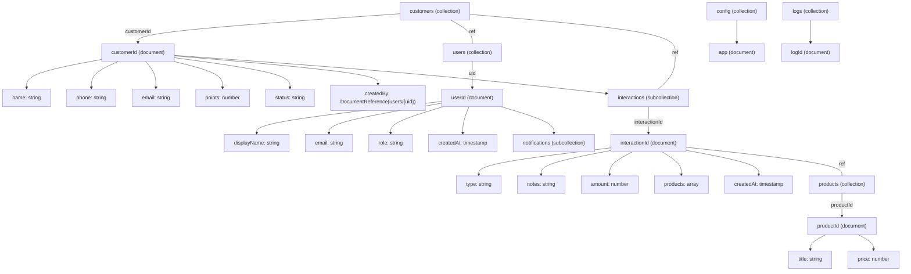

# Firestore Schema for GrowTown

This document defines the Firestore data model for GrowTown (Customer Management System).

## Overview
Collections and documents are designed for scalability, minimal reads, and straightforward queries.

## Schema Diagram



## Top-level Collections

1. `users` (auth-linked)
   - Document ID: `uid` (Firebase Auth UID)
   - Fields:
     - `displayName`: string
     - `email`: string
     - `photoURL`: string (nullable)
     - `role`: string ("admin" | "staff")
     - `createdAt`: timestamp
     - `updatedAt`: timestamp
   - Subcollections:
     - `notifications` (per-user notifications)

2. `customers`
   - Document ID: auto-generated or business-provided
   - Fields:
     - `name`: string
     - `email`: string (nullable)
     - `phone`: string
     - `address`: map { street, city, state, postalCode, country } (optional)
     - `tags`: array<string>
     - `points`: number (loyalty points)
     - `status`: string ("active" | "inactive")
     - `createdBy`: DocumentReference -> `users/{uid}`
     - `createdAt`: timestamp
     - `updatedAt`: timestamp
   - Subcollections:
     - `interactions` (grows large; see below)

3. `products` (optional catalog)
   - Document ID: auto
   - Fields: `title`, `description`, `price`, `sku`, `stock`, `images` (array)
   - `createdAt`, `updatedAt`

4. `orders` / `interactions`
   - Option A (recommended): `customers/{customerId}/interactions`
     - Each interaction document:
       - `type`: string ("visit" | "purchase" | "call" | etc.)
       - `notes`: string
       - `amount`: number (if purchase)
       - `products`: array of maps { productRef: DocumentReference, qty: number, price: number }
       - `createdBy`: DocumentReference -> `users/{uid}`
       - `createdAt`: timestamp
   - Option B: global `interactions` collection with `customerId` field (useful for cross-customer queries)

5. `config` (single doc or small collection)
   - Document: `app` or `pricing` etc.
   - Fields: feature flags, settings

6. `logs` (append-only)
   - Document ID: auto
   - Fields: `type`, `message`, `meta` (map), `createdAt`

## Subcollection Rationale
- `customers/{customerId}/interactions` keeps customer-related data grouped and avoids reading large arrays.
- `users/{uid}/notifications` allows efficient per-user reads and deletes.

## Indexing Recommendations
- Single-field indexes: `customers.status`, `customers.createdBy`, `customers.tags`
- Composite indexes for queries combining `createdBy` + `createdAt` or `status` + `createdAt` where needed.

## Naming & Conventions
- Fields: lowerCamelCase
- Timestamps: `createdAt`, `updatedAt` (Firestore `Timestamp`)
- References: use `DocumentReference` fields when pointing to another document
- IDs: use auto-generated IDs unless a natural key (e.g., SKU) is required

## Sample Documents

`users/aliceUid`
```json
{
  "displayName": "Alice Patel",
  "email": "alice@example.com",
  "photoURL": null,
  "role": "admin",
  "createdAt": "2026-02-09T10:00:00Z",
  "updatedAt": "2026-02-09T10:00:00Z"
}
```

`customers/abc123`
```json
{
  "name": "Ravi Sharma",
  "email": "ravi@example.com",
  "phone": "+919876543210",
  "address": { "street": "12 MG Road", "city": "Mumbai", "state": "MH", "postalCode": "400001", "country": "IN" },
  "tags": ["wholesale","priority"],
  "points": 120,
  "status": "active",
  "createdBy": "users/aliceUid",
  "createdAt": "2026-02-08T09:00:00Z",
  "updatedAt": "2026-02-08T09:00:00Z"
}
```

`customers/abc123/interactions/itx001`
```json
{
  "type": "purchase",
  "notes": "Bought widgets",
  "amount": 590,
  "products": [{ "productRef": "products/prod1", "qty": 2, "price": 295 }],
  "createdBy": "users/aliceUid",
  "createdAt": "2026-02-08T09:05:00Z"
}
```

## Next Steps
- Add Mermaid diagram to this file and to `README.md` (visualization)
- Create sample queries and Firestore security rules draft (optional)

