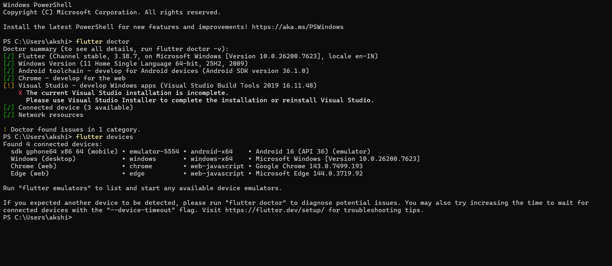
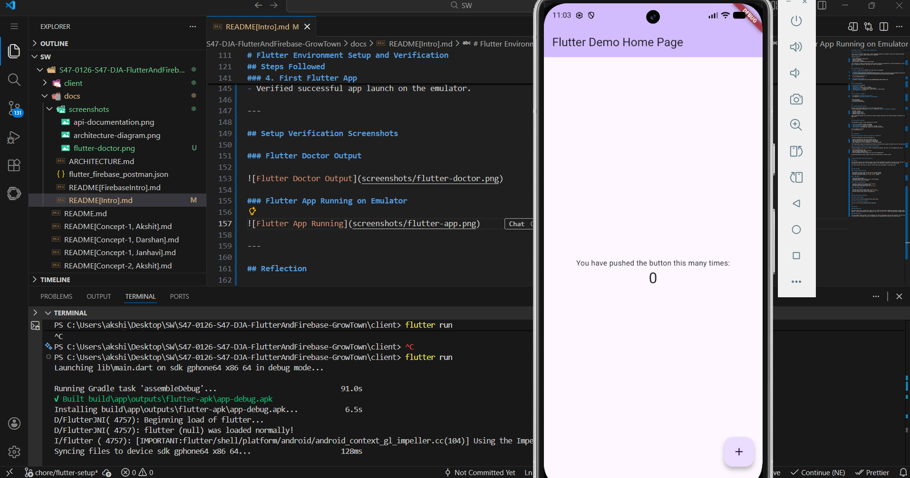

# GrowTown – Flutter + Firebase Project Documentation

## 📱 Project Overview

**GrowTown** is a Flutter-based mobile loyalty management application designed to help local businesses manage customers and reward loyalty through a simple, mobile-first experience.

The app focuses on:

- Phone number–based authentication
- Customer management
- Loyalty points tracking
- Real-time data synchronization using Firebase

This repository includes the application code, system architecture documentation, and API documentation to ensure the project is easy to understand, maintain, and extend for future contributors.

---

## 📄 Documentation Links

> ⛳ **Note:** Links will be updated once final assets are uploaded.

- **API Documentation (Postman Collection):**
  🔗 *https://joint-operations-technologist-45324879-9451211.postman.co/workspace/note-app~ef982212-7a97-421a-8d6b-d2b179c63f9b/collection/47185198-e4477309-c25f-4d5f-9f7a-6f5a1decb4bc?action=share&creator=47185198*

- **Architecture Documentation:**
  📘 `docs/ARCHITECTURE.md`

- **High-Level Design (HLD):**
  🔗 *https://drive.google.com/file/d/16Tfvyd8QBYpPFGyaBHLluWmPcrj6tQP7/view*

---

## 🧩 Project Metadata

- **Project Name:** GrowTown
- **Version:** `1.0.0`
- **Tech Stack:** Flutter, Dart, Firebase
- **Authentication:** Firebase Phone Authentication
- **Backend Services:** Firebase Auth, Cloud Firestore, Cloud Storage
- **Last Updated:** `2026-01-23`

---

## 📸 Screenshots & Diagrams

- ✅ Screenshot of **Postman API Collection**
- ✅ Screenshot of **System Architecture / HLD Diagram**

```
/docs/screenshots/
 ┣ api-documentation.png
 ┗ architecture-diagram.png
```

---

## 🧪 API Documentation Summary

GrowTown uses Firebase SDKs directly from the Flutter application.
The API documentation provided via **Postman** represents **logical API operations** such as:

- Customer creation
- Fetching customer lists
- Updating loyalty points
- Dashboard summary retrieval

These documented endpoints help simulate and explain backend interactions even though Firebase is SDK-driven rather than REST-first.

---

## 🏗 Architecture Overview

The application follows a clean separation of concerns:

- **UI Layer:** Flutter screens and widgets
- **State Management:** Provider / Riverpod
- **Service Layer:** Firebase Auth, Firestore, Storage services
- **Data Models:** Structured Dart models for Firestore collections

For full details, refer to:
📘 **`ARCHITECTURE.md`**

---

## 🤝 Reflection

### How API Documentation Improves Collaboration & Onboarding

Clear API documentation allows new developers to:

- Quickly understand how data flows through the app
- Identify authentication and authorization requirements
- Test backend interactions independently using Postman
- Reduce dependency on verbal explanations or code walkthroughs

This significantly speeds up onboarding and minimizes confusion when multiple contributors work on the same codebase.

### How Versioning & Metadata Ensure Long-Term Consistency

Including metadata such as version numbers, authentication methods, base URLs, and last-updated dates helps:

- Track API changes over time
- Avoid breaking changes without awareness
- Maintain backward compatibility
- Ensure documentation stays aligned with the actual implementation

Versioned documentation makes GrowTown scalable and maintainable as features evolve.

---

# Flutter Environment Setup and Verification

## Overview

This document verifies the successful setup of the Flutter development environment. The goal of this task was to install Flutter, configure the required tools, run an Android emulator, and successfully launch a Flutter application.

This setup ensures the system is ready for Flutter mobile app development in upcoming sprints.

---

## Steps Followed

### 1. Flutter SDK Installation

- Downloaded the Flutter SDK from the official Flutter website.
- Extracted the SDK and added `flutter/bin` to the system PATH.
- Verified installation using the `flutter doctor` command.

### 2. IDE Setup

- Installed Android Studio.
- Configured Android SDK, Platform Tools, and AVD Manager.
- Installed Flutter and Dart plugins.

### 3. Emulator Configuration

- Created an Android Virtual Device (Pixel series).
- Started the emulator using AVD Manager.
- Verified device connection using `flutter devices`.

### 4. First Flutter App

- Created a new Flutter project using `flutter create`.
- Ran the default Flutter counter app using `flutter run`.
- Verified successful app launch on the emulator.

---

## Setup Verification Screenshots

### Flutter Doctor Output



### Flutter App Running on Emulator



---

## Reflection

### Challenges Faced

During the setup, minor configuration steps such as installing Android SDK components and emulator images required attention. However, Flutter’s documentation and diagnostic tools like `flutter doctor` made troubleshooting straightforward.

### Learning Outcome

This environment setup provides a solid foundation for Flutter development. With the SDK, emulator, and IDE properly configured, I can now focus on building, testing, and deploying Flutter applications efficiently in future sprints.
